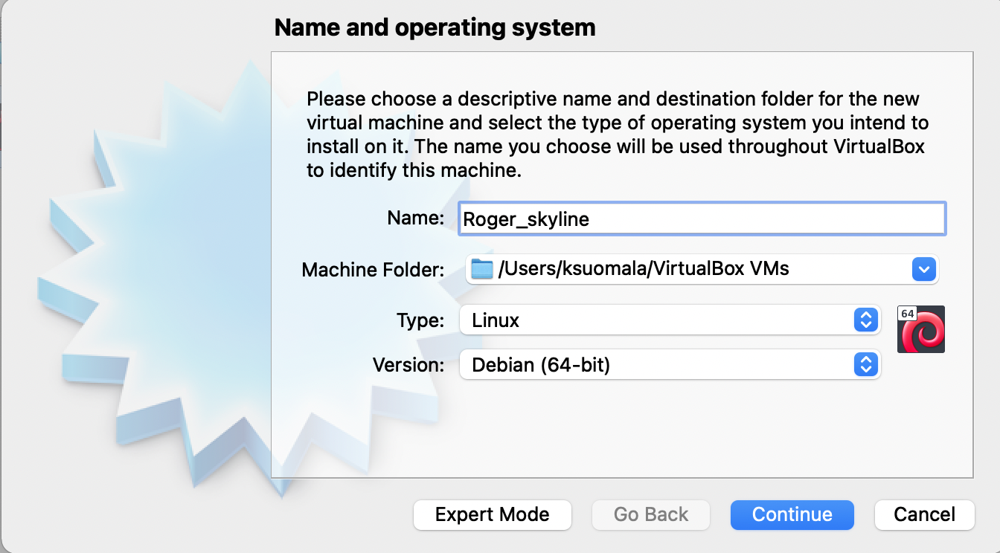

# Roger_skyline
Configuring a web server on a virtual machine. Hive Helsinki project.

Tutorial:

part I

Subject:

"You have to run a Virtual Machine (VM) with the Linux OS of your choice (Debian
Jessie, CentOS 7...) in the hypervisor of your choice (VMWare Fusion, VirtualBox...).
• A disk size of 8 GB.
• Have at least one 4.2 GB partition.
• It will also have to be up to date as well as the whole packages installed to meet
the demands of this subject."

I chose Debian for the operating system. I downloaded debian-11.2.0-amd64-netinst.iso from https://www.debian.org.

